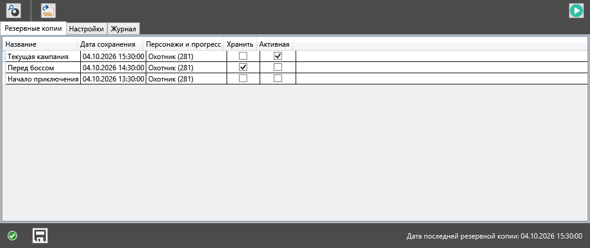
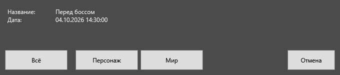
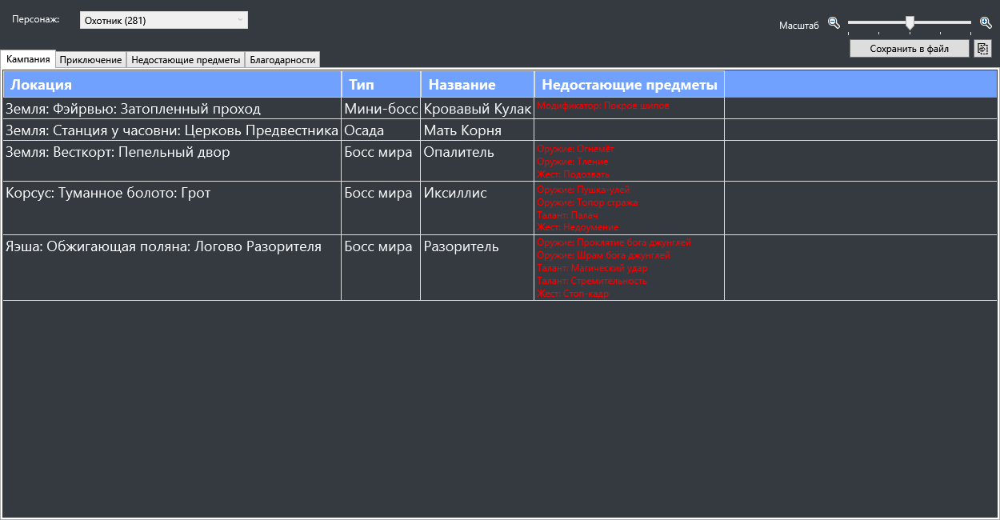
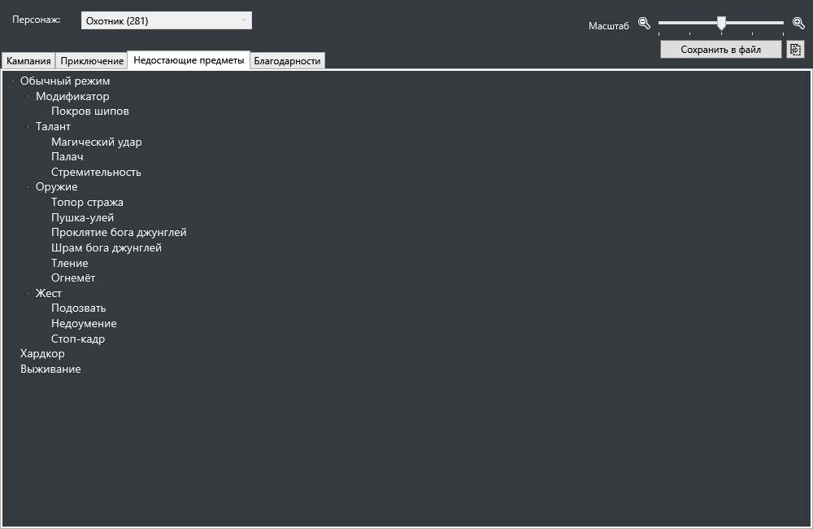
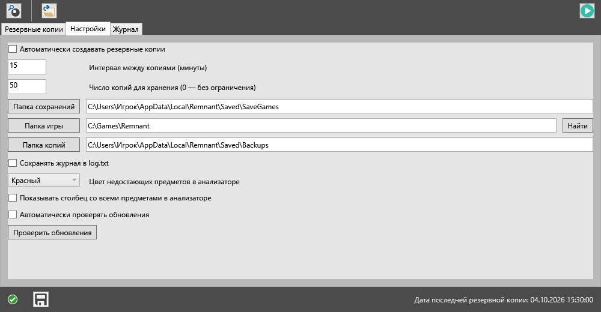

# Руководство по Remnant Save Manager

Русская версия менеджера сохранений для **Remnant: From the Ashes**. Здесь описаны установка, резервное копирование, восстановление, анализ мира и настройки программы.

Снимки показывают интерфейс скомпилированной русской версии 1.101.0.1 на демонстрационных сохранениях. Названия копий и игровые данные приведены для примера.

## Установка

1. Скачайте последний ZIP со [страницы русских релизов](https://github.com/PavelZagumenkin/RemnantSaveManager_Razzmatazzz_RU/releases/latest).
2. Распакуйте архив в удобную папку. Оставьте `RemnantSaveManager.exe`, файл конфигурации и `GameInfo.xml` рядом друг с другом.
3. Запустите `RemnantSaveManager.exe`.
4. На вкладке **«Настройки»** проверьте папки сохранений, игры и резервных копий.

Требуется Windows с [.NET Framework 4.7.2](https://dotnet.microsoft.com/download/dotnet-framework/net472) или новее. Устанавливать программу через отдельный установщик не нужно. Перевод встроен в EXE.

Обычная папка сохранений игры:

```text
%LOCALAPPDATA%\Remnant\Saved\SaveGames
```

В ней находятся `profile.sav` и файлы миров `save_*.sav`. Если ваши сохранения лежат в другом месте, выберите их папку кнопкой **«Папка сохранений»**.

## Главное окно и резервные копии



После запуска на вкладке **«Резервные копии»** отображаются найденные копии. При первом запуске список может быть пустым.

| Столбец | Значение |
| --- | --- |
| **Название** | Название резервной копии. По умолчанию используется числовая метка времени. Дважды нажмите ячейку, чтобы задать понятное имя, например «Перед боссом». |
| **Дата сохранения** | Дата и время сохранения, из которого создана копия. |
| **Персонажи и прогресс** | Классы персонажей и приблизительный прогресс. Число в скобках отражает количество распознанных записей инвентаря, включая таланты, броню, оружие и украшения; это не процент прохождения. |
| **Хранить** | Защищает выбранную копию от автоматического удаления при достижении лимита. |
| **Активная** | Отмечает копию, соответствующую текущему игровому сохранению. |

Зелёный значок слева внизу означает, что текущее сохранение уже имеет резервную копию. Когда сохранение изменяется и ещё не скопировано, становится доступна кнопка с дискетой рядом со значком состояния.

### Создание копии

Нажмите кнопку с дискетой **внизу окна**, чтобы сохранить текущее состояние. Если нужна постоянная копия, задайте ей название и отметьте **«Хранить»**.

Кнопки вверху окна:

- **Лупа** — анализ текущего игрового сохранения.
- **Папка** — открытие папки резервных копий в проводнике.
- **Запуск** — запуск игры, если её папка настроена правильно.

### Действия с копией

Нажмите нужную строку правой кнопкой мыши. В меню доступны:

- **«Восстановить резервную копию»**.
- **«Восстановить копию и запустить игру»**.
- **«Анализ мира»** — анализ именно выбранной копии.
- **«Открыть в проводнике»** — открытие папки выбранной копии.
- **«Удалить»** — удаление выбранной резервной копии.

### Восстановление

Закройте игру, выберите резервную копию и откройте **«Восстановить резервную копию»** через контекстное меню.



| Кнопка | Что восстанавливается |
| --- | --- |
| **Всё** | Полное сохранение: профиль персонажей и файлы миров. |
| **Персонаж** | Профиль `profile.sav`, содержащий данные персонажей. |
| **Мир** | Файлы миров `save_*.sav`. Профиль персонажей остаётся текущим. |
| **Отмена** | Закрывает окно без восстановления. |

При полном восстановлении выбранная копия становится текущим игровым сохранением. Перед восстановлением программа создаёт копию текущего сохранения, если оно ещё не скопировано.

Если число персонажей в текущем сохранении отличается от числа миров в выбранной копии, восстановление только мира требует дополнительного подтверждения в программе. Для обычного возврата к прежнему состоянию используйте **«Всё»**.

## Анализ мира



Откройте анализатор кнопкой с лупой для текущего сохранения или пунктом **«Анализ мира»** в меню резервной копии.

Если в сохранении несколько персонажей, выберите нужного в поле **«Персонаж»**. Вкладки **«Кампания»** и **«Приключение»** показывают соответствующие миры выбранного персонажа. Если мир приключения отсутствует, его вкладка недоступна.

Таблица показывает локацию, тип события, его название и **недостающие предметы**, связанные с этим событием. В настройках можно дополнительно включить столбец **«Все предметы»**.

Местоположение предметов — ориентир по игровому справочнику. Оно не всегда точно: предмет, указанный для подземелья, может находиться в открытом мире рядом с ним. Наличие события и предмета в списке также не означает, что все условия получения уже выполнены.

Анализатор текущего сохранения обновляется при сохранении игры. Анализ резервной копии показывает состояние этой копии. Размер текста меняется ползунком **«Масштаб»** справа вверху; при необходимости используйте прокрутку таблицы.

### Недостающие предметы



Вкладка **«Недостающие предметы»** показывает общий список предметов, которых нет у выбранного персонажа, по комплектному справочнику. Список сгруппирован по режимам **«Обычный режим»**, **«Хардкор»** и **«Выживание»**, затем по категориям.

Этот список шире списка наград текущего мира: часть предметов потребует другого набора событий, другого режима или выполнения особых условий. Наведите указатель на предмет, чтобы посмотреть примечание, если оно есть в справочнике.

Правой кнопкой мыши можно открыть меню предмета: **«Открыть вики»** ведёт к статье об игровом предмете, а **«Копировать»** копирует его название. Названия статей передаются на английском, чтобы ссылка открывала нужную страницу.

Кнопка **«Сохранить в файл»** экспортирует текущую вкладку, а кнопка копирования справа от неё помещает отчёт в буфер обмена. Названия, категории и подписи в отчётах переведены на русский.

## Настройки



| Настройка | Назначение |
| --- | --- |
| **Автоматически создавать резервные копии** | Следить за изменениями игровых сохранений и создавать копии автоматически. Программа должна оставаться запущенной. |
| **Интервал между копиями (минуты)** | Минимальный интервал между автоматическими копиями. Значение задаётся в минутах. |
| **Число копий для хранения** | Лимит копий. При его превышении удаляются самые старые копии без отметки «Хранить». `0` означает отсутствие ограничения. |
| **Папка сохранений** | Папка игровых сохранений, которые нужно читать и копировать. |
| **Папка игры** | Папка установленной Remnant для запуска игры из программы. Кнопка «Найти» пытается определить её автоматически. |
| **Папка копий** | Место хранения резервных копий. |
| **Сохранять журнал в log.txt** | Записывать сообщения программы в файл журнала. Сообщения также доступны на вкладке «Журнал». |
| **Цвет недостающих предметов в анализаторе** | Красный или белый цвет текста предметов. |
| **Показывать столбец со всеми предметами в анализаторе** | Дополнительно показывать все предметы каждого события. |
| **Автоматически проверять обновления** | Проверять обновления программы и игрового справочника. Обновления программы ведут к русским релизам этого проекта. |
| **Проверить обновления** | Запустить проверку вручную. |

## Дополнительная помощь

Типовые вопросы рассмотрены на странице [«Помощь»](Help.md). Сведения о переводе и сборке находятся в [русской инструкции проекта](https://github.com/PavelZagumenkin/RemnantSaveManager_Razzmatazzz_RU/blob/main/README.ru.md).
